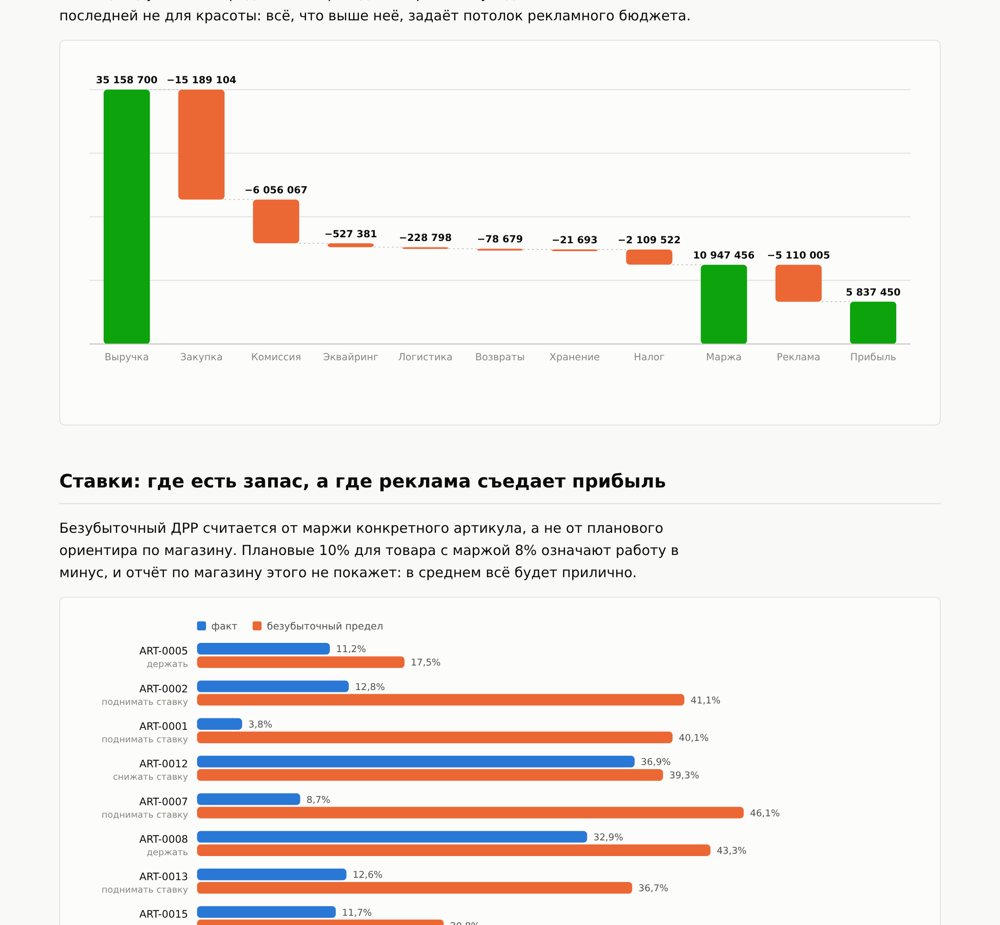

# unit-economics-engine

Движок юнит-экономики маркетплейса: P&L по каждому артикулу, безубыточный ДРР
и решение по рекламной ставке. На входе три CSV, на выходе отчёт одним файлом.



## Зачем

Отчёт по магазину показывает средние величины, и в них тонет главное. Средний
ДРР 12% при среднем нормативе 15% выглядит благополучно ровно до того момента,
когда выясняется, что три артикула из двадцати четырёх работают в минус и
съедают прибыль остальных.

Этот движок считает экономику **по каждому артикулу отдельно** и отвечает на
один вопрос: сколько ещё можно потратить на рекламу этого товара, прежде чем
он перестанет приносить деньги.

## Запуск

```bash
pip install -e ".[dev]"
make demo       # сгенерировать демонстрационные данные, 24 артикула за полгода
make report     # посчитать и собрать docs/report.html
make check      # показать только то, что требует решения
make test       # 57 тестов
```

На своих данных:

```bash
unit-econ report --data ./my-data --html report.html --fixed-costs 1500000
unit-econ check --data ./my-data --tax-rate 0.15
```

## Что показывает на демонстрационных данных

```
Требуют решения: 3 из 24

  ART-0020  Планшеты        прибыль    -315378 ₽   ДРР 42.6% при пределе 15.9%   выключать рекламу
  ART-0016  Электробритвы   прибыль     -22711 ₽   ДРР 45.2% при пределе 37.8%   выключать рекламу
  ART-0024  Аксессуары      прибыль     -16505 ₽   ДРР 51.0% при пределе 43.6%   выключать рекламу

Суммарный убыток по ним: 354595 ₽
```

Обратите внимание на ART-0020: у планшета безубыточный предел всего 15,9%,
потому что наценка к закупке низкая, а комиссия площадки высокая. Плановый
ориентир «до 20% ДРР», разумный для аксессуаров, для этого артикула означает
работу в минус.

## Три решения, вокруг которых собран расчёт

**Деньги считаются в Decimal, ни одного float.** На копейках float
накапливает ошибку, и годовая сумма перестаёт сходиться с выгрузкой площадки.
Есть тест, где тысяча операций по копейке дают ровно десять рублей, и второй,
показывающий, что на float это не работает.

**Возврат это не отсутствие продажи.** Выручки по нему нет, закупка не
списывается (товар вернулся на склад), а логистика оплачена в обе стороны.
Самая частая ошибка в самодельных расчётах — просто выкинуть возвраты из
выгрузки, и тогда артикул с четвертью возвратов выглядит прибыльным.

**Безубыточный ДРР считается от маржи конкретного артикула.** Не от планового
норматива по магазину. Товар с маржой 8% при ДРР 9% укладывается в норматив
«не выше 10%» и при этом работает в минус, а средние по магазину этого
никогда не покажут.

Полное описание модели: [docs/METHOD.md](docs/METHOD.md).

## Тест, который держит всю формулу

```python
def test_breakeven_drr_makes_profit_exactly_zero(sku, order):
    """Если потратить на рекламу ровно безубыточный ДРР от выручки,
    прибыль обязана оказаться нулевой."""
```

Это не пример с придуманными числами, а проверка согласованности: формула
безубыточного ДРР либо сходится с расчётом P&L, либо нет. Рядом стоит второй
вариант — от точной маржи прибыль обнуляется вообще без допуска, а от
опубликованного процента с одним знаком после запятой в пределах округления.
Допуск в тесте выведен из числа знаков, а не подобран под результат.

## Место, где первая версия ошиблась

ABC-анализ определял класс по накопленной доле **после** товара. Товар,
который в одиночку перешагивает 80% выручки, попадал в класс B, и класса A
в ассортименте не оказывалось вовсе. Правило звучит как «товары, которые
вместе набирают первые 80%», значит тот, кто пересекает черту, входит в A.
Теперь класс определяется долей, накопленной до товара, и это закреплено
тестом `test_a_single_dominant_sku_still_belongs_to_class_a`.

## Формат входных данных

`skus.csv`

| колонка | смысл |
|---|---|
| sku_id, article, title, category | идентификация |
| cost_price | закупочная цена за единицу |
| volume_l | литраж, нужен для логистики и хранения |
| commission_rate | комиссия площадки, доля |

`orders.csv`: date, sku_id, marketplace, units, price, is_returned
`ads.csv`: date, sku_id, spend

Загрузчик называет номер строки и колонку: файл почти всегда правят руками
в Excel, и падать где-то в глубине с `ValueError` он не должен. Метка BOM,
которую Excel добавляет при сохранении, обрабатывается отдельно и покрыта
тестом.

## Отчёт

Один HTML-файл без единой внешней загрузки: открывается в письме, в
мессенджере и на компьютере без интернета. Графики рисуются своим кодом в
SVG, светлая и тёмная темы обе продуманы, широкие таблицы прокручиваются
внутри себя. Есть тест, который падает, если в отчёте появится внешняя
ссылка или скрипт.

## Устройство

```
unit_economics/
  money.py       Decimal, округление, доли
  models.py      Sku, Order, AdSpend, Tariffs, BidPolicy
  pnl.py         расчёт P&L и решение по ставке
  analysis.py    ABC и точка безубыточности
  loader.py      чтение CSV с внятными ошибками
  charts.py      SVG своими руками, без библиотек
  report.py      Markdown и HTML
  demo.py        генератор данных от зерна
  cli.py         команды report, check, abc, summary, demo
tests/           57 тестов
docs/METHOD.md   описание модели
```

Зависимости: click. Больше ничего.

## Лицензия

MIT.
